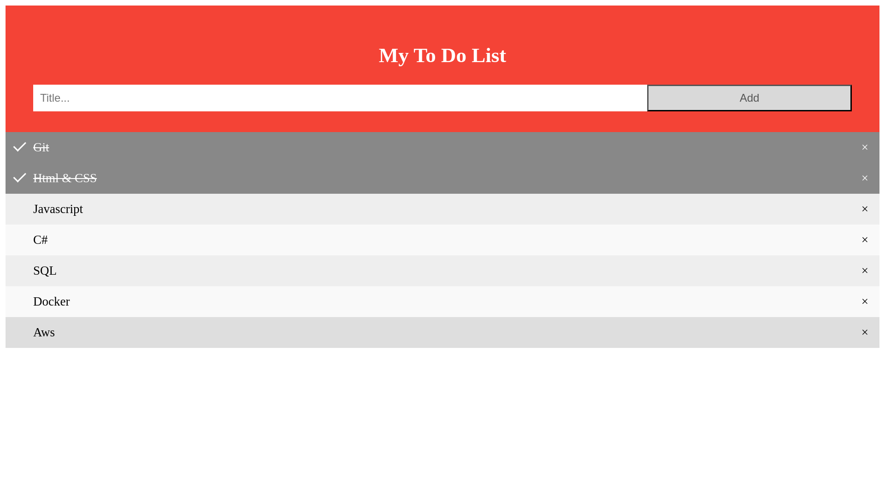

| Keyword/Method                | Description                                                                                                                                                 | Example                                                                                                                                                        |
|-------------------------------|-------------------------------------------------------------------------------------------------------------------------------------------------------------|----------------------------------------------------------------------------------------------------------------------------------------------------------------|
| `localStorage`                 | A browser object used for storing key-value pairs persistently in the web browser.                                                                        | `localStorage.setItem('tasks', JSON.stringify(tasks));`                                                                                                       |
| `getItem()`                    | Retrieves the value associated with a specific key from `localStorage`. Returns `null` if the key doesn't exist.                                             | `var tasks = localStorage.getItem('tasks');`                                                                                                                 |
| `setItem()`                    | Stores a key-value pair in `localStorage`. The value is stored as a string.                                                                                | `localStorage.setItem('tasks', JSON.stringify(tasks));`                                                                                                       |
| `JSON.parse()`                 | Converts a JSON string into a JavaScript object. Useful for parsing data retrieved from `localStorage`.                                                     | `tasks = JSON.parse(localStorage.getItem('tasks'));`                                                                                                        |
| `JSON.stringify()`             | Converts a JavaScript object into a JSON string. Required before storing objects in `localStorage`.                                                        | `localStorage.setItem('tasks', JSON.stringify(tasks));`                                                                                                       |
| `document.createElement()`     | Creates an HTML element dynamically, specified by the tag name.                                                                                          | `var li = document.createElement("li");`                                                                                                                      |
| `document.createTextNode()`    | Creates a text node that can be appended to an element.                                                                                                   | `var t = document.createTextNode(task.text);`                                                                                                                 |
| `appendChild()`                | Adds a child element or node to a parent element.                                                                                                          | `li.appendChild(t);`                                                                                                                                          |
| `classList.add()`              | Adds a specified class to an element’s `classList`. Useful for applying CSS styles dynamically.                                                           | `li.classList.add('checked');`                                                                                                                                 |
| `setAttribute()`               | Sets an attribute and its value on an HTML element.                                                                                                        | `li.setAttribute('data-id', task.id);`                                                                                                                       |
| `getElementsByTagName()`       | Returns a live HTMLCollection of elements with the specified tag name.                                                                                   | `var myNodelist = document.getElementsByTagName("LI");`                                                                                                     |
| `addEventListener()`           | Attaches an event listener to an element. Used to trigger a function when an event occurs.                                                                 | `document.getElementById("addBtn").addEventListener('click', newElement);`                                                                                   |
| `event.target`                 | Refers to the DOM element that triggered the event.                                                                                                       | `if (event.target.classList.contains('close')) { var li = event.target.parentElement; }`                                                                    |
| `event.key`                    | Returns the key value when a key is pressed in a keyboard event (e.g., `Enter`).                                                                          | `if (event.key === 'Enter') { newElement(); }`                                                                                                               |
| `filter()`                     | Creates a new array with elements that pass the test implemented by the provided function.                                                                | `tasks = tasks.filter(task => task.id !== taskId);`                                                                                                         |
| `style.display`                | Controls the visibility of an element. Setting to `"none"` hides the element.                                                                             | `li.style.display = "none";`                                                                                                                                  |
| `alert()`                      | Displays an alert dialog box with a specified message.                                                                                                    | `alert("You must write something!");`                                                                                                                         |
| `keydown` Event                | Triggered when a key is pressed down. Used to listen for keyboard inputs.                                                                                 | `document.getElementById("myInput").addEventListener('keydown', function(event) { if (event.key === 'Enter') { newElement(); } });`                        |

