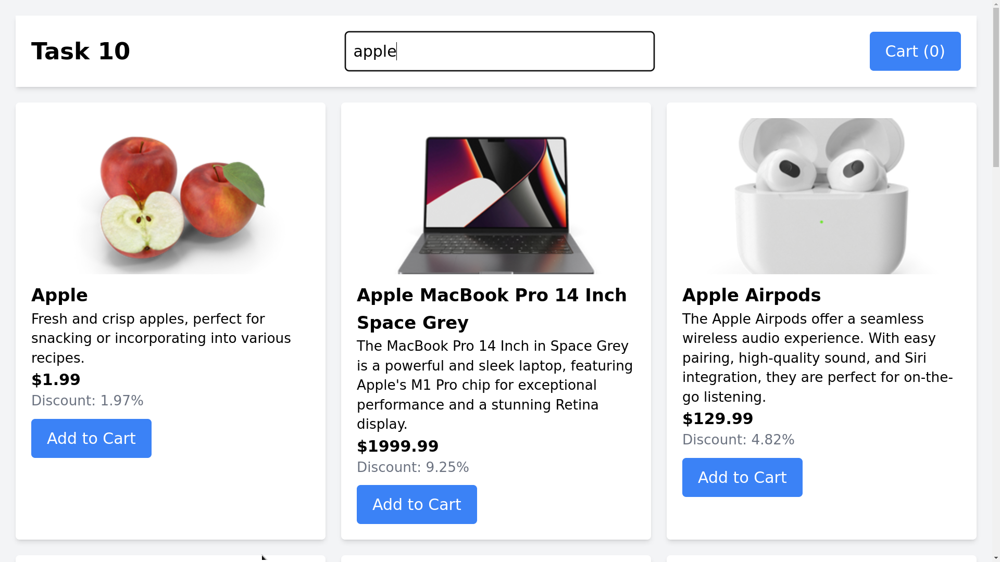
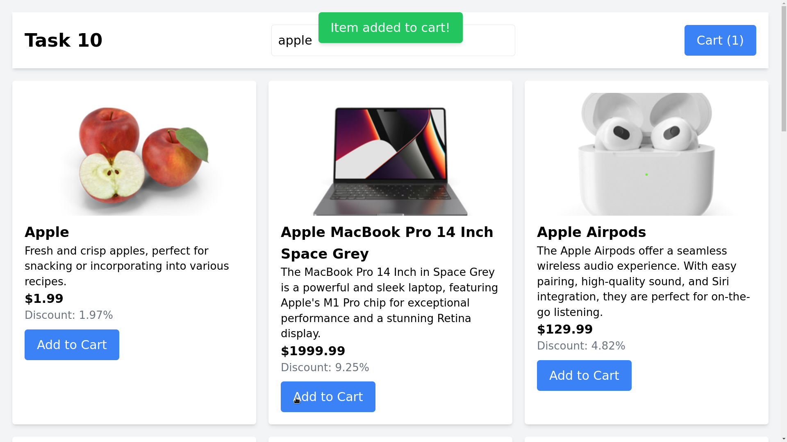
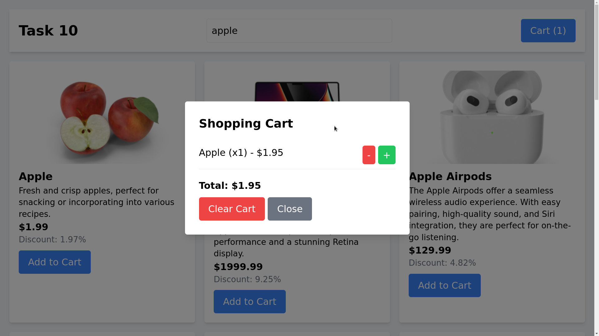

# JavaScript Concepts Used in the eCommerce Cart

## 1. **Event Listeners**
   - `document.addEventListener("DOMContentLoaded", () => { ... })`
   - Ensures the script runs only after the DOM has fully loaded.

## 2. **DOM Manipulation**
   - `document.getElementById("elementId")`
   - `document.createElement("tag")`
   - `element.innerHTML = "..."` → Dynamically updates content.
   - `element.classList.add("class-name")` → Adds CSS classes dynamically.

## 3. **Fetching Data from API**
   - `fetch("https://dummyjson.com/products")`
   - `response.json()` → Converts the response into JSON format.

## 4. **Rendering Dynamic Content**
   - `renderProducts(products)` → Generates product cards dynamically.
   - `renderCart()` → Updates cart content dynamically.

## 5. **Handling User Input**
   - `searchInput.addEventListener("input", (e) => fetchProducts(e.target.value))`
   - Calls `fetchProducts()` with the search query as the user types.

## 6. **Managing State with Local Storage**
   - `localStorage.setItem("cart", JSON.stringify(cart))`
   - `JSON.parse(localStorage.getItem("cart")) || []` → Retrieves the cart state.

## 7. **Cart Management Functions**
   - `addToCart(id, name, price, discount)` → Adds item to cart.
   - `removeFromCart(id)` → Removes an item from the cart.
   - `increaseQuantity(id)` → Increases item quantity.
   - `renderCart()` → Updates cart UI.

## 8. **Modal & Popup Handling**
   - `cartBtn.addEventListener("click", () => cartModal.classList.remove("hidden"))`
   - `closeCartBtn.addEventListener("click", () => cartModal.classList.add("hidden"))`
   - `showPopup()` → Displays a smooth transition popup notification.

## 9. **Mathematical Operations**
   - `discountedPrice = item.price * (1 - item.discount / 100)`
   - Calculates the final price after discount.

## 10. **Using Timeout for UI Effects**
   - `setTimeout(() => popup.classList.add("hidden"), 2000)`
   - Hides popup notification after 2 seconds.
