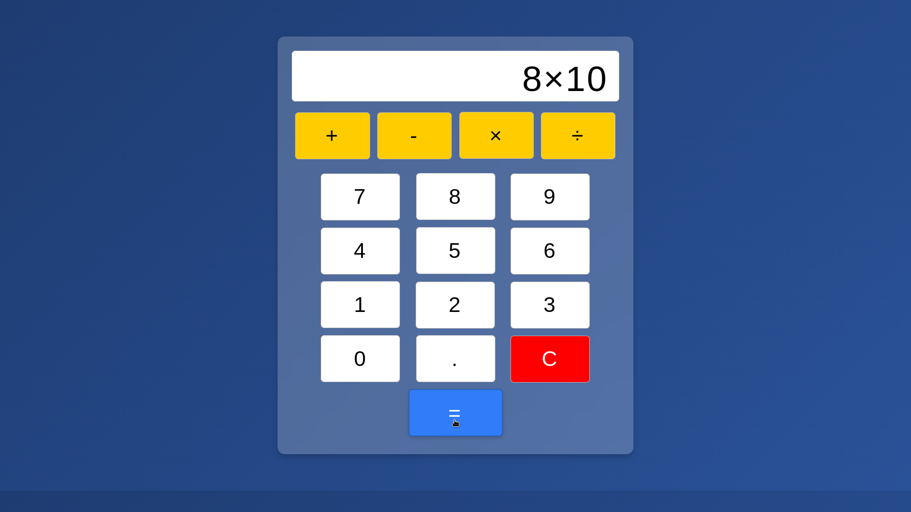

| Concept            | Description |
|--------------------|-------------|
| **Strict Mode** (`"use strict"`) | Enforces stricter parsing and error handling in JavaScript. |
| **DOM Manipulation** | Uses `document.getElementById()` and `document.querySelectorAll()` to access elements. |
| **Event Listeners** | `addEventListener("click", function(e) { ... })` attaches click events to buttons. |
| **String Manipulation** | `innerHTML`, `.substring()`, `.replace()`, and `.split()` are used to modify and extract parts of strings. |
| **Arrays** | `split()`, `splice()`, and `indexOf()` are used to manipulate lists of numbers and operators. |
| **Operators Handling** | Mathematical operations are applied in a sequence (division, multiplication, subtraction, addition). |
| **Loops** | `for` loops iterate through buttons to add event listeners. |
| **While Loop** | Used to apply calculations iteratively on the numbers array. |
| **Boolean Flags** | `resultDisplayed` helps track when a result is shown to reset input if needed. |
| **Console Logging** | `console.log()` is used to debug by logging variable values. |
