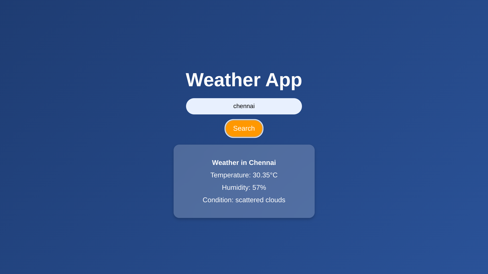

| Concept                          | Description |
|----------------------------------|------------|
| `fetch('env.json')`              | Fetches an external JSON file containing the API key. |
| `.then(response => response.json())` | Converts the API response into a JavaScript object. |
| `document.getElementById('searchBtn').addEventListener('click', () => {...})` | Adds a click event listener to trigger a function when the button is clicked. |
| `fetch(\`${apiUrl}?q=\${city}&appid=\${apiKey}&units=metric\`)` | Constructs the API URL dynamically using template literals and fetches weather data. |
| `if (!response.ok) { throw new Error('City not found'); }` | Checks if the API response is valid; throws an error if the city is not found. |
| `.catch(error => alert(error.message));` | Catches and handles errors, displaying an alert with the error message. |
| `document.getElementById('cityName').textContent = \`Weather in \${data.name}\`;` | Updates the webpage dynamically with weather details. |
