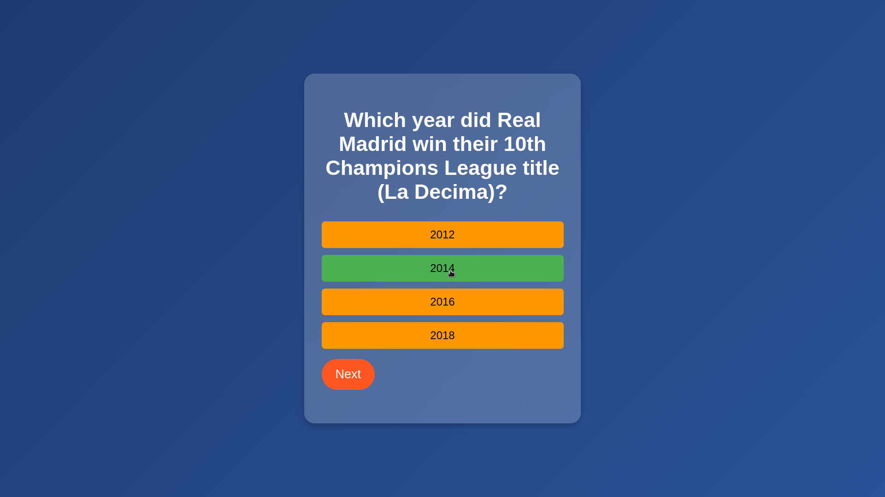
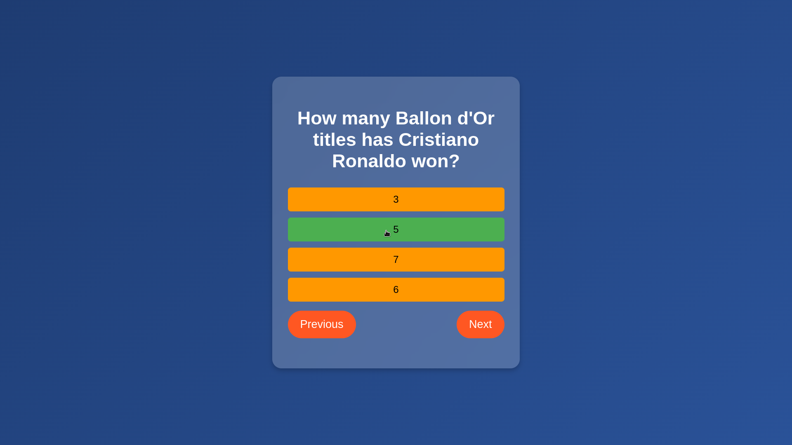
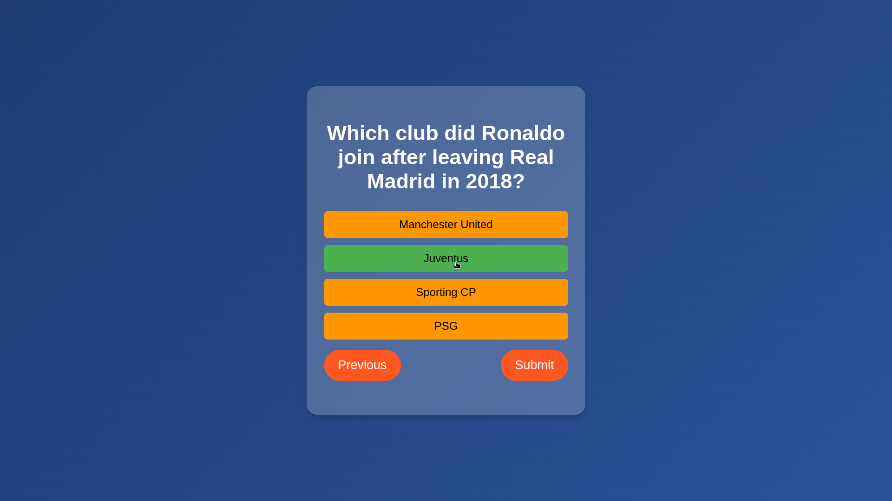

# JavaScript Concepts Used in the Quiz App

| Concept               | Description |
|----------------------|-------------|
| **`fetch()` API** | Used to retrieve the JSON file containing quiz questions asynchronously. |
| **`.then()` & `.catch()`** | Handles asynchronous operations: `.then()` processes the response, and `.catch()` handles errors. |
| **`JSON.parse()` (implicit in `.json()`)** | Converts the JSON response into a JavaScript object. |
| **`let` & `const`** | `let` is used for variables that change, while `const` is used for fixed values like DOM elements. |
| **DOM Manipulation (`document.getElementById`)** | Used to dynamically update the question, options, and buttons. |
| **Event Listeners (`addEventListener`)** | Listens for clicks on buttons to navigate through the quiz or select answers. |
| **Template Literals (`` ` ` ``)** | Used to dynamically insert JavaScript expressions within strings (in `showResult()`). |
| **Array Methods (`forEach`, `reduce`, `fill`)** | `forEach` loops through options, `reduce` calculates the score, and `fill` initializes an array. |
| **Arrow Functions (`() => {}`)** | Shorter function syntax used in event listeners and callbacks. |
| **Conditional Statements (`if`, `? :` ternary)** | Controls navigation logic, score calculation, and button visibility. |
| **Dynamic Element Creation (`document.createElement`)** | Generates answer option buttons dynamically. |
| **CSS Styling via JavaScript (`element.style`)** | Changes button background color to indicate selected answers. |
| **Hiding & Showing Elements (`element.style.display`)** | Hides questions after completion and displays the final score. |
