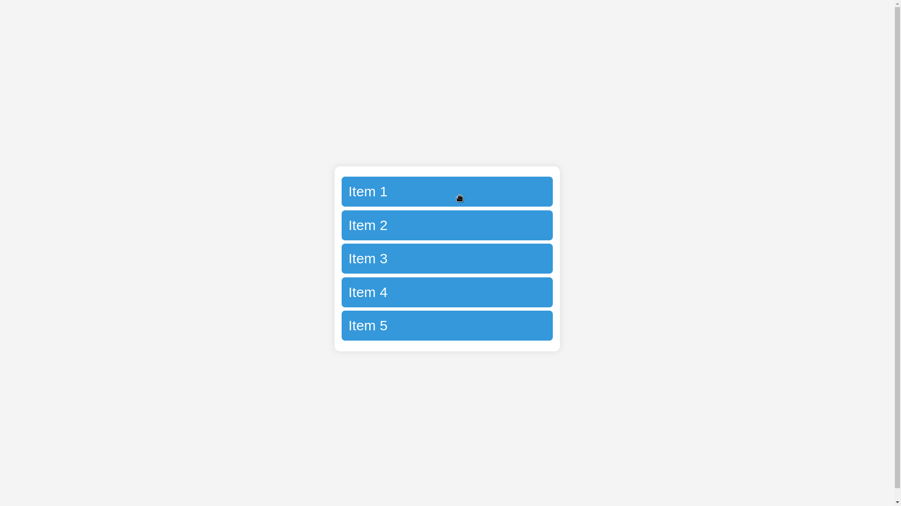
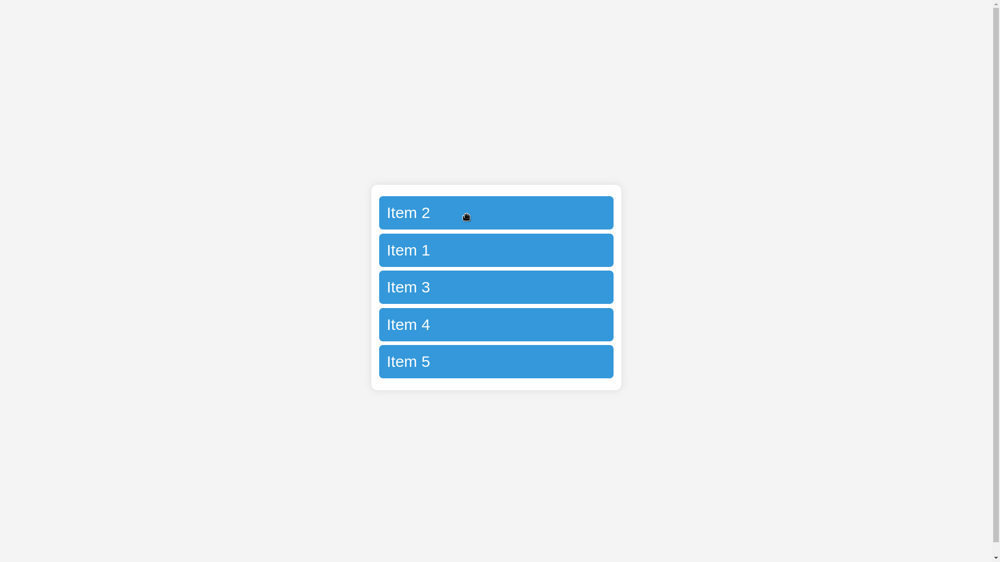

# JavaScript Concepts Used in Drag and Drop

| Concept                 | Description |
|-------------------------|------------|
| **`document.addEventListener`** | Adds an event listener to the document that executes when the page loads. |
| **`querySelectorAll`** | Selects all elements matching a given CSS selector. |
| **`forEach`** | Iterates over a NodeList of elements. |
| **`dragstart` event** | Fired when a draggable element starts being dragged. |
| **`setTimeout`** | Delays execution of a function by a specified time. Used to add a class after the drag starts. |
| **`classList.add` / `classList.remove`** | Adds or removes a CSS class from an element to modify its appearance. |
| **`dragend` event** | Fired when a draggable element is released. |
| **`dragover` event** | Fired when an element is dragged over another element. `preventDefault()` allows dropping. |
| **`preventDefault`** | Prevents the default behavior of an event, needed for `dragover` to allow dropping. |
| **`insertBefore`** | Moves the dragged element before another element in the DOM, updating the list order dynamically. |
