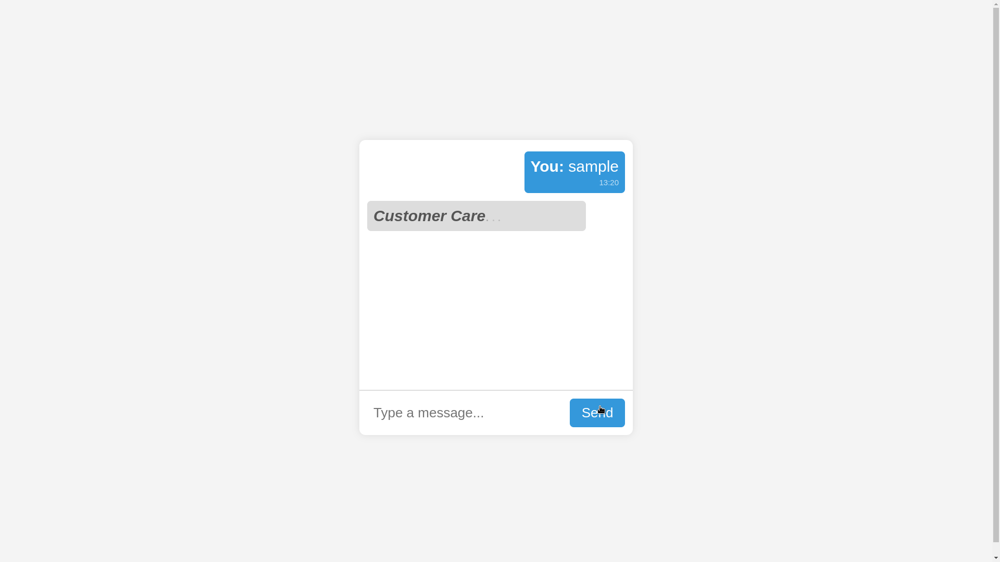
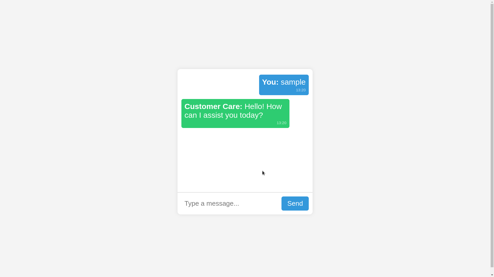

# JavaScript Concepts Used in Real-time Chat Simulation

| Concept               | Description |
|----------------------|-------------|
| **DOM Manipulation** | Used `document.createElement()`, `appendChild()`, and `innerHTML` to dynamically update chat messages. |
| **Event Handling**   | `onclick` event is used for the send button to trigger message sending. |
| **setTimeout**       | Delays the "Customer Care" response by 2 seconds to simulate real-time chat behavior. |
| **setInterval (Commented Out)** | Can be used to repeatedly send automatic responses at fixed intervals (currently disabled). |
| **String Methods**   | `trim()` is used to remove extra spaces from user input before sending the message. |
| **Array Methods**    | `Math.random()` and `Math.floor()` are used to randomly select a response from the predefined messages array. |
| **CSS Animation (via JS)** | Uses `@keyframes` in CSS and manipulates elements dynamically to create a blinking "typing" effect. |
| **Date & Time**      | `new Date().toLocaleTimeString()` is used to generate and display message timestamps. |
| **Scroll Handling**  | `scrollTop = scrollHeight` ensures the latest messages are always visible in the chat window. |
