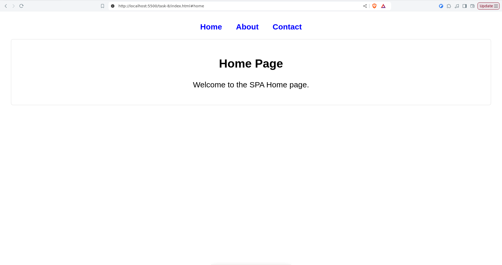
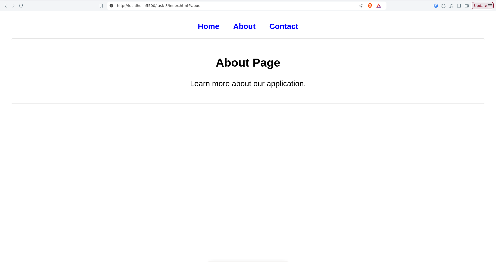
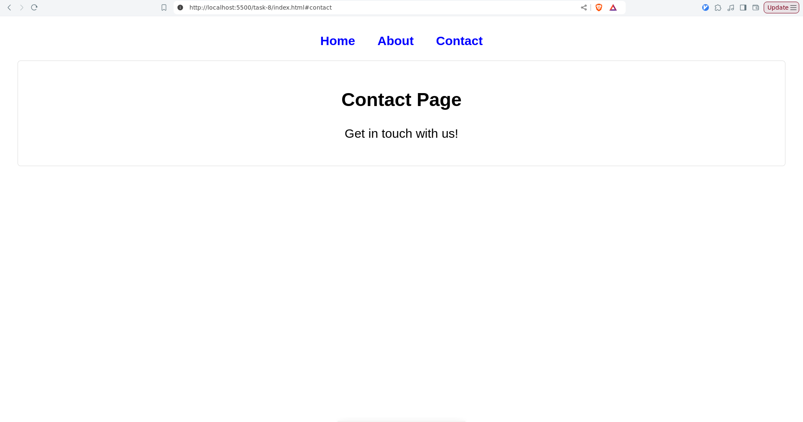

| **Code Section** | **Purpose** |
|------------------|------------|
| Remove `active` class from all views | Ensures only one section is shown at a time |
| Get `location.hash` and remove `#` | Extracts the route from the URL |
| Default to `'home'` if no hash exists | Provides a fallback page |
| Find the matching `id` and add `active` class | Shows the correct section |
| Listen for `hashchange` and `load` events | Updates the view dynamically |
