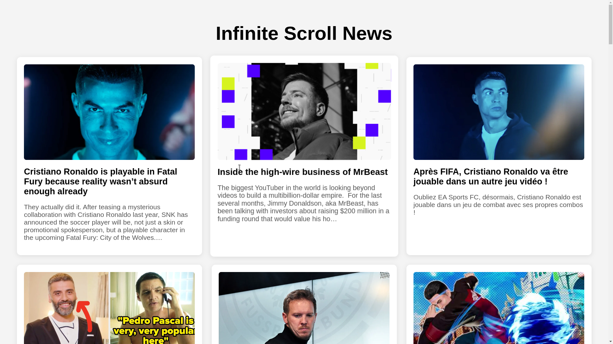

# JavaScript Concepts Used in Infinite Scroll News Loader

| Concept                    | Description |
|----------------------------|-------------|
| **Fetch API**              | Used to make asynchronous requests to the news API and retrieve JSON data. |
| **JSON Parsing (`.json()`)** | Parses the response from the API into a JavaScript object. |
| **DOM Manipulation**        | Dynamically creates and appends news cards using `document.createElement()`. |
| **Event Listeners (`addEventListener`)** | Listens for `scroll` events to trigger data fetching. |
| **Throttling** (`throttle`) | Prevents excessive function calls when scrolling rapidly. |
| **Scroll Detection**        | Checks if the user is near the bottom using `window.innerHeight` and `scrollY`. |
| **State Management** (`isFetching`) | Prevents multiple API calls by tracking request status. |
| **Template Literals**       | Used for inserting dynamic values into HTML using backticks (`` ` ``). |
| **Arrow Functions (`=>`)**  | Used for cleaner function expressions. |
| **Async/Await**            | Handles asynchronous requests cleanly without callback hell. |
| **Promise Handling (`try...catch`)** | Catches errors in API calls and prevents app crashes. |
| **Dynamic JSON Loading**    | Reads `env.json` to retrieve API keys dynamically. |

